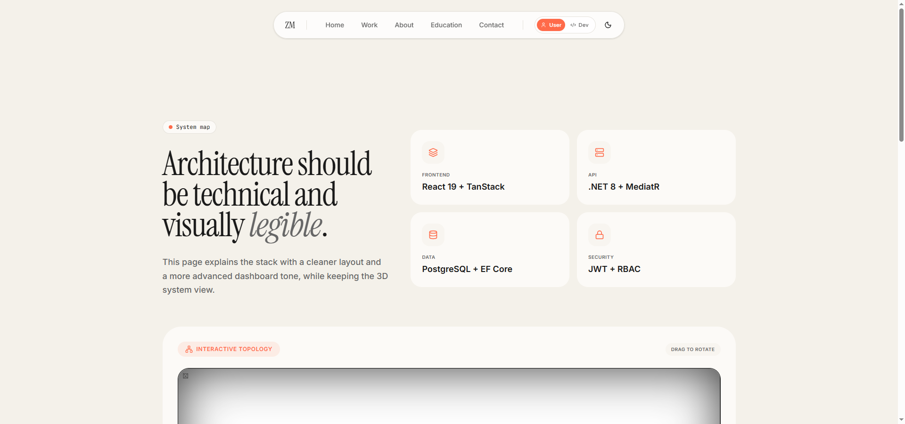

# Zeyad Mohammed — Portfolio

> A premium portfolio featuring an interactive admin console, CRUD-based project/education management, a live API developer lab, and a 3D architectural topology viewer.



---

## Features

### Public Pages
- **Home** — Animated hero, selected projects grid with tilt cards, tech marquee, expertise section.
- **Projects** — Filterable gallery (`frontend` / `backend` / `fullstack` / `mobile`) with live mouse-parallax image previews and individual detail pages.
- **Project Detail** — Hero image, description, image gallery, tech stack, metrics, external links.
- **About** — Biography, experience timeline, education history, social links.
- **Education** — Degree timeline, specializations grid.
- **Contact** — Form with backend validation, direct API submission.

### Admin Console (`/admin`)
| Route | Description |
|---|---|
| `/admin` | Dashboard with stats, recent messages, quick-action links |
| `/admin/projects` | **CRUD** — Create, Read, Update, Delete projects with full form validation |
| `/admin/education` | **CRUD** — Create, Read, Update, Delete education entries |
| `/admin/messages` | Read, search, filter, delete, mark-as-processed contact submissions |
| `/admin/login` | JWT-based authentication, localStorage session |

### Developer Lab (`/dev`)
| Route | Description |
|---|---|
| `/dev` | Interactive API console — build requests, edit bodies, set resource IDs, view JSON responses |
| `/dev/upload` | Drag-and-drop image upload with MIME validation, 5 MB limit, real-time server response |
| `/dev/architecture` | 3D system topology rendered with Three.js / React Three Fiber |

### Easter Eggs
- Type `zeyad` anywhere on the page to trigger admin authentication
- Key shortcuts: `d` (dev lab), `a` (admin), `p` (projects)

---

## Screenshots

### Architecture Page


> *The 3D topology viewer displaying distributed system architecture with interactive Three.js nodes.*

---

## Tech Stack

### Frontend
| Layer | Technologies |
|---|---|
| Framework | React 19, TypeScript |
| Routing | TanStack Router (type-safe, SSR-ready) |
| Styling | TailwindCSS v4, CSS modules, `tw-animate-css` |
| Animation | Framer Motion (page transitions, scroll animations, parallax) |
| 3D | Three.js, React Three Fiber, Drei |
| Forms | React Hook Form, Zod |
| State | Zustand, TanStack React Query |
| UI | 30+ Radix UI primitives, Sonner (toasts), Vaul (drawers) |
| Charts | Recharts |
| Icons | Lucide React |

### Backend (External API)
| Layer | Technology |
|---|---|
| API | .NET 8 / C# |
| Auth | JWT with Bearer tokens |
| Database | PostgreSQL via Entity Framework Core |
| Hosted | `zeyadportfolio.runasp.net` |

### Tooling
| Tool | Purpose |
|---|---|
| Vite 7 | Build tool and dev server |
| TanStack Start | SSR framework |
| Nitro | Server engine with Vercel preset |
| ESLint | Static analysis |
| Prettier | Code formatting |
| TypeScript | Type safety |

---

## Architecture

```
┌─────────────────────────────────────────────────────┐
│                   Browser (Client)                    │
│  ┌─────────────────────────────────────────────────┐ │
│  │           TanStack Router (SSR-ready)            │ │
│  │  ┌─────────┐ ┌──────────┐ ┌──────────────────┐  │ │
│  │  │  Public  │ │  Admin   │ │    Dev Lab       │  │ │
│  │  │  Routes  │ │  Routes  │ │  (API Console,   │  │ │
│  │  │          │ │  (CRUD)  │ │   Upload, 3D)    │  │ │
│  │  └─────────┘ └──────────┘ └──────────────────┘  │ │
│  └─────────────────────────────────────────────────┘ │
│                        ↕                             │
│            fetch() / fetchJson()                     │
└──────────────────────┬──────────────────────────────┘
                       ↕ HTTPS
┌──────────────────────┴──────────────────────────────┐
│          .NET 8 REST API (runasp.net)                 │
│  ┌────────────┐ ┌────────────┐ ┌──────────────────┐  │
│  │   Public    │ │   Admin    │ │     Auth         │  │
│  │  Endpoints  │ │ Endpoints  │ │  (JWT/RBAC)      │  │
│  └────────────┘ └────────────┘ └──────────────────┘  │
│                       ↕                               │
│                PostgreSQL / EF Core                   │
└──────────────────────────────────────────────────────┘
```

---

## API Endpoints

### Public
| Method | Path | Description |
|---|---|---|
| `GET` | `/api/projects` | List all projects |
| `GET` | `/api/education` | List education entries |
| `POST` | `/api/contact` | Submit contact form |

### Auth
| Method | Path | Description |
|---|---|---|
| `POST` | `/api/auth/login` | Get JWT token |
| `POST` | `/api/auth/refresh` | Refresh expired token |

### Admin (requires Bearer token)
| Method | Path | Description |
|---|---|---|
| `GET` | `/api/admin/projects` | List all projects (admin) |
| `POST` | `/api/admin/projects` | Create project |
| `PUT` | `/api/admin/projects/:id` | Update project |
| `DELETE` | `/api/admin/projects/:id` | Delete project |
| `GET` | `/api/admin/education` | List education (admin) |
| `POST` | `/api/admin/education` | Create education entry |
| `PUT` | `/api/admin/education/:id` | Update education entry |
| `DELETE` | `/api/admin/education/:id` | Delete education entry |
| `GET` | `/api/admin/contact` | List contact messages |
| `PATCH` | `/api/admin/contact/:id` | Mark message processed |
| `DELETE` | `/api/admin/contact/:id` | Delete message |
| `POST` | `/api/admin/upload` | Upload image asset |
| `GET` | `/api/admin/stats` | Dashboard statistics |

### Debug
| Method | Path | Description |
|---|---|---|
| `GET` | `/api/debug/boom` | Intentional 500 error envelope |

---

## CRUD Operations

### Projects
![CRUD Projects]

The **Projects** admin panel (`/admin/projects`) provides full CRUD:
- **List** — Filtered/searchable table with type badges, stack tags, year
- **Create** — Slide-out drawer with fields: name, tagline, description, type, year, stack (tag input), image URL, GitHub handle, live URL
- **Update** — Same form pre-populated with existing data
- **Delete** — Confirmation dialog with animated warning

### Education
The **Education** admin panel (`/admin/education`) provides CRUD:
- **List** — Cards showing degree, school, years
- **Create/Update** — Side drawer with school, degree, focus, timeline, notes
- **Delete** — Confirm modal with entry details

### Messages
The **Messages** panel (`/admin/messages`) provides:
- **List** — Searchable, filterable (all/pending/processed)
- **Expand** — Reveals full message body
- **Mark Processed** — Toggle read status
- **Delete** — Remove from database

---

## Getting Started

```bash
# Install dependencies
npm install

# Start development server
npm run dev

# Build for production
npm run build

# Preview production build
npm run preview

# Lint
npm run lint

# Format
npm run format
```

### Environment Variables

| Variable | Default | Description |
|---|---|---|
| `VITE_API_BASE_URL` | `https://zeyadportfolio.runasp.net` | Backend API base URL |

### Build Configuration
- **Vite** on port `8080` with host `0.0.0.0`
- **Nitro** with **Vercel** preset for serverless deployment
- **TailwindCSS v4** with custom design tokens
- Path alias `@/` → `./src/`

---

## Deployment

The project is configured for **Vercel** deployment:

```bash
npm run build
npx nitro deploy --prebuilt
```

The build output is in `.vercel/output/` ready for Vercel's CLI or Git integration.

---

## Project Structure

```
src/
├── components/
│   ├── 3d/           # Three.js components (Robot, System Nodes, Hero)
│   ├── admin/        # Admin shell, project-type badge
│   └── ui/           # 40+ Radix + custom UI components
├── hooks/
│   ├── use-api.ts    # Generic fetch hook with auto-refetch on mutations
│   └── use-mobile.tsx
├── lib/
│   ├── api-client.ts  # fetchJson wrapper, type definitions, transformer
│   ├── mode-context.tsx # App-wide context (auth, theme, mode)
│   ├── robot-state.ts  # Robot animation state manager
│   └── utils.ts
├── routes/
│   ├── __root.tsx     # Root layout, analytics, keyboard shortcuts
│   ├── index.tsx      # Home page
│   ├── projects.tsx   # Projects layout
│   ├── projects.index.tsx  # Projects listing
│   ├── projects.$id.tsx    # Project detail
│   ├── about.tsx      # About page
│   ├── education.tsx  # Education page
│   ├── contact.tsx    # Contact form
│   ├── admin.tsx      # Admin layout + auth guard
│   ├── admin.index.tsx    # Dashboard
│   ├── admin.projects.tsx # CRUD projects
│   ├── admin.education.tsx # CRUD education
│   ├── admin.messages.tsx  # Message management
│   ├── admin.login.tsx     # Login form
│   ├── dev.index.tsx       # API console
│   ├── dev.upload.tsx      # Upload lab
│   └── dev.architecture.tsx # 3D topology
├── router.tsx         # Router configuration
├── routeTree.gen.ts   # Auto-generated route tree
└── styles.css         # Tailwind, theme variables, utilities
```

---

## License

Built with intention by [Zeyad Mohammed](https://github.com/zeyadmohammeds).
